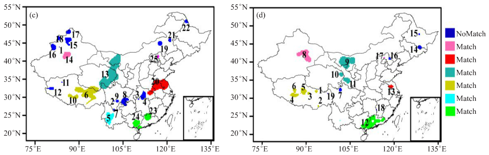

==========
技术方案
==========

.. contents ::

模式检验评估不仅是发展预报系统的重要组成部分，而且可以用来评价模式预报的准确性，从而为用户提供客观的预报依据。事实上，由于模式预报系统的底层物理过程十分复杂，其预报结果存在很大的不确定性，因此，通过评估检验来获得模式的特定属性和外在表现就成为用户研究和应用模式的重要手段。模式检验中最古老的方法是通过目视进行误差主观对比分析，尽管主观的目视误差分析或天气个例分析能够准确给出模式对降水系统诸如锋面、雨带预报性能的详细描述，然而目视分析存在显著缺陷，它一方面无法客观分析海量数据，另一方面通过自视检验获得的结论也具有主观性和非定量性，因此很难为用户提供有效的判别标准。随着模式检验需求的不断扩大和气象科研工作者的持续努力，一系列客观的模式评估检验方法得到了快速发展。

MET模式评估工具库(Model Evaluation Tools）是由美国国家大气研究中心（NCAR）研究应用实验室（RAL）开发的数值预报检验系统。MET除了支持传统的客观站点检验外，还可针对格点化实况对高分辨率数值预报产品检验。

其主要目的是为数值预报使用者、开发者搭建分析、评估数值模式预报产品的桥梁，它不仅为模式开发者提供实时的模式产品测试环境，为新的模式预报产品投入预报业务提供一揽子评估方案，而且为模式使用者客观把握模式的预报能力提供了有效手段。MET最初版本发行于2008年，主要针对于WRF数值模式产品的检验和评估，其最新版本MET8.1发行于2019年9月，提供各种通用数据格式的模式产品检验评估接口。本系统对MET的功能、数据流、算法作了进一步的模块化包装，尤其时候针对中国的数据环境，开发了一系列数据接口，方便用户的安装，使用，维护和升级。

MET系统架构和数据流
====================

MET的初始研发理念是为短期天气预报提供最为先进的数值天气预报模式产品评估检验方案，这种理念使得MET系统不仅囊括了传统的经典模式检验方法，同时不断地吸纳包括空间分析、诊断分析等在内的一系列新的检验方法。此外，MET增加了模式评估结果置信度检验等功能，这也使得MET快速取代传统的模式评估系统，比如MET已经取代了NCEP的模式实时校验系统。

MET是一种开放系统，可以在DTC网站自由下载。MET4.1以前的版本不包括台风预报检验，MET4.1及以后的版本增加了模式预报台风路径检验模块，但MET开发组认为台风路径检验本质上和模式其他要素检验是不同的，DTC给出的无论是台风检验程序包，还是说明文档，均为单独的一个部分：MET-TC。 MET采用模块化设计，具有很强的适应性，一种方法的检验模块可以独立运行而不依赖于其他组件，这种设计使得MET不仅能够在具有复杂数据输入、输出接口的各种大型数据库系统上运行，而且也方便运行于个人计算机。按照MET系统组件的功能的差异，可以将其分为格式转换模块、核心算法模块、统计输出模块以及绘图输出模块四个部分。

   MET系统的基本架构及数据流（卷角方框表示数据的输入或输出，带阴影的椭圆表示可执行程序，箭头表示数据流）
   
上图给出了MET系统的基本架构及数据流。图中带阴影的椭圆表示MET的实际可执行程序，卷角方框表示数据输入或输出。可以看出，MET主要接收五类观测数据：格点数据、MODIS卫星观测数据、WWMCA格式云分析数据、ASCII格式站点观测数据、PrepBufr格式观测数据以及MADIS格式观测数据，其中PrepBufr是NCEP的一种站点格式的观测数据，而MADIS是NOAA所收集和整理的另一类站点格式数据文件。这些数据格式均被转换成NetCDF格式进行计算。在新版本中也可以直接输入Grib或Grib2格式数据。数据绘图程序可以显示转码后的格点或站点数据，生成PS格式图表。

MET的核心模块包括格点检验、站点检验、集合预报检验、小波检验、面向对象（基于目标）的MODE检验和时序检验六个部分，其中概率预报检验分别包含于站点检验和格点检验之中。MET的输出主要包括三类：NetCDF、ASCII格式计算结果以及PS格式或PNG格式图片文件。为了清楚反映模式的预报性能，通常还需要对输出结果进行再分析。表1列出了MET5.0部分程序及其功能介绍。
表1 MET主要的模块程序及功能

---------------------------------
组件类别 | 应用程序名称 | 功能描述
---------------------------------
数据转换 | Gen-Ploy-Mask | 产生指定区域的地理信息文件，掩盖区域之外的数据
-------------------------------------------------------------------
        | Pcp-Combine | Grib码数据计算、融合并转换成NetCDF格点观测数据
-------------------------------------------------------------------
        | ASCⅡ2NC | ASCⅡ站点观测数据转换成NetCDF格点观测数据
-------------------------------------------------------------------
        | MADIS2NC | MADIS站点格式的同化数据转换成标准的NetCDF格式
-------------------------------------------------------------------
核心算法 | grid_stat | 模式格点预报检验，要求观测数据与模式数据格点一致
-------------------------------------------------------------------
        | point_stat | 将模式输出数据插值到站点，计算评分指数
-------------------------------------------------------------------
	    | series_ analysis | 计算区域内同一格点上一段时间内的模式预报评分指数
----------------------------------------------------------------------
	    | mode_ analysis | 采用面向对象方法进行空间评估，计算预报和观测对象的属性差异
----------------------------------------------------------------------------
	    || wavelet stat || 将两维的数据分解为强度和尺度，评估预报在空间上的不确定性
--------------------------------------------------------------------
	    || Ensemble stat || 集合预报检验，输出等级直方图、离散度、连续等级概率评分等
-------------------------------------------------------------------
数据绘图  || plot_point_ obs || 绘制转换格式后的站点数据，输出PS格式站点图形文件
----------------------------------------------------------------------
	    || plot_data_plane || 绘制格点格式的模式预报或观测数据，输出PS格式格点图形文件
-------------------------------------------------------------------------------
	    || wwmca_plot || 绘制WWMCA格式的云分析数据，输出PS格式的图形文件
---------------------------------------------------------------------
	    || Mode-Script || 用R脚本绘制MODE检验的分析结果，输山PS格式的图形文件
-----------------------------------------------------------------------
  
台风检验（MET-TC)
======================

MET模式评估系统将台风检验（MET-TC）作为一个独立的部分单独列出。MET-TC的输入文件的数据格式包括两个部分：涡旋追踪软件和实时模式预报产生的ATCF （Automated Tropical Cyclone Forecast）格式的台风路径文件以及ASCII码格式的海岸、岛屿的经纬度文件，输出文件包括两类：NetCDF格式和ASCII码格式的中间文件以及ASCII码格式的评估结果。
MET-TC有三个可执行程序：TC-DLAND、TC-Pairs、TC-STAT。 TC-DLAND主要任务在于快速解析限定范围、满足条件的水域到陆地或岛屿的距离。从4.1版本到5.0版本，TC-DLAND的主要变化是将可解析的范围从地球的1/4扩大至全球，解析结果更加精确，但相比以前版本，计算速度下降。由于TC-OLAND解析出的NetCDF格式文件可以重复使用，因此TC-DLAND并不需要在模式检验中实时运行，这也是提高运算效率的一种方法。TC-Pairs主要功能是检验模式对台风位置、强度预报的准确性。TC-Pairs接收两种类AFCF格式的文件：

1. 台风路径预报文件ADECK; 
#. 观测追踪的最佳台风路径BDECK，从而计算模式预报台风的位置、海平面气压、强度等误差。TC-STAT对TC-Pairs的多个计算结果再进行统计分析，给出模式预报性能的具体评估结果。

下图给出了MET-TC系统的基本架构及数据流，需要说明的是，作为后处理部分，MET-TC给出了R脚本的绘图程序 :code:`plot_tcmpr.R`，一些相关的脚本并未包含在程序的架构框图中。

 
   MET-TC系统的基本架构及数据流（方框表示数据的输入和输出，带阴影的椭圆表示可执行程序，箭头表示数据流）

MET部分检验方法及应用
==========================

MET系统包括了传统的经典检验方法，这些方法在模式检验中已得到了较好的应用，因此这里仅简单列出MET计算的一些主要统计技巧评分。在计算这些评分时，MET也利用了两变量的列联表来将事件进行分类，然后将预报事件与观测事件进行匹配并计算一系列评分指数，对于可分为两种类型的离散形变量主要包括：预报偏差Bias、胜算比OR（Odds Ratio）、 GSS (Gilbert Skill Score）或ETS (Equitable Threat Score）评分、准确率ACC (Accuracy）等。对于可分为多种类型的离散型变量来说，采用了n×2的列联表将不同分级上事件发生的频率分别归类来计算评分指数，这种方法也用于检验概率预报中不同事件发生概率的准确性。针对离散型变量，MET主要计算了标准差（STDEV）、距平相关系数（ACC）、斯皮尔曼相关系数（SP_CORR）、Kendall等级相关系数（KT CORR）、均方根误差（CRMSE）、误差百分位数等相关指标。

由于近两年概率预报、集合预报、高分辨模式预报产品重点在预报业务中推广，下面重介绍MET系统的概率预报、集合预报和高分辨率空间诊断检验方法。

概率预报和集合预报
========================

对于普通的概率预报，MET系统通过n×2的列联表，按照用户给定的阀值将发生总概率为0～1的事件分为n种不同的类别，以此来评估概率预报的性能，如果获得事件发生的概率是通过公式计算产生的，则指定分段区间的中值为事件发生的概率。当然这种方法也可以用来检验集合预报系统所产生的概率预报，之所以单独列出，是因为MET针对集合预报及其概率给出了独立的评估工具Ensemble_stat。

将每一个概率预报区间内事件出现的概率分为发生和不发生两种情况，“F”代表预报，“O”代表观测；Nij表示相应类型 “预报——观测” 发生的次数，其中，N 的下标i表示预报，j表示观测， 因此N11、N10 分别表示第一个概率预报区间内降水事件发生和空报的次数；N21、N20 则表示第二个概率预报区间，以此类推。然后，分别统计各种可能性出现的次数，在此基础上计算各种评分技巧，计算的评分指数主要包括Brier评分、联合分布、似然基准率、可靠性图、ROC ( Relative Operating Characteristic）分析等。

MET系统检验集合预报时采用通用的方法，首先将集合预报转换成单个值的确定性预报或离散事件的概率预报。计算的评分指数包括四类：

1. 连续分级概率评分CRPS ( Continuous Ranked Probability Score)
2. 等级直方图或Talagrand图
#. “未知”评分IGN ( Ignorance score)
#. 概率积分变换PIT( Probability Integral Transform) 

PIT是模拟的预报成员与观测值离散程度的概率分布表现，其解释意义与Talagrand图一致。其中，CRPS在检验连续变量的概率预报应用最为广泛。CRPS是所有可能阈值Brier技巧的积分，本质上表现的是集合预报变量的累计概率分布函数（CDF）与观测值Heaviside函数之间的差异。MET系统在计算CRPS评分时去除了确定性预报中的平均绝对误差，因此能够直接用来比较集合预报与确定性预报之间的准确性，CRPS越小，表示预报准确率越高，理想情况下CRPS=0。

MET采用Talagrand图来衡量集合预报成员与观测值离散程度分布是否一 致。当集合预报与观测具有相同的变化时，观测的等级排名将按照预报成员的离散度均匀分布，绘制出的Talagrand图应该是平直的，但是在大多数情况下集合预报各成员的发散度不够，落在两端的概率要比落在中间的概率要大。Talagrand图并不用来反映预报的准确性，此外，Talagrand图仅仅针对集合成员固定的情况下才有意义，因此MET给出的Talagrand图更多是针对模式开发者对模式的检验。

IGN是MET给出的集合预报的负向的对数概率密度分布函数，用来检验预报与观测要素的概率分布函数的相似程度，其值越小，表示预报效果越好。在MET中，IGN指数计算时基于集合预报的成员的预报结果满足正态分布，对非正态分布的气象要素，IGN指数并不适用。

空间诊断分析
====================

天气变量在空间上具有连续性。点对点的传统检验方法拆离了变量的空间关系，其检验结果不仅不具有明确的物理意义，而且近年来新出现的高分辨率模式产品在空间上具有更多的小尺度的变化，使得传统检验方法无法正确评估模式的预报技巧，因此随着模式的改进，诊断检验方法孕育而生。MET系统提供多种空间诊断检验方法，主要包括MODE及邻域检验方法。

MODE方法的基本观念来自Davis等，实现时首先通过给定的卷积半径R对原始降水场卷积，然后按给定的阂值解析出满足条件的空间降水对象，在此基础上计算各对象的降水强度、质，心、轴角、面积复杂度等各种属性。MET系统可以根据设定的判别标准对独立的降水对象进行组合，并计算组合对象的各种属性。考虑到一个对象的不同属性可能有不同的表现，MET采用模糊逻辑来综合考虑各种属性的总体表现，从而计算预报对象的总收益函数。

式（1）给出了收益函数T(a）的计算表达式，式中表示对象的第i个属性，Wi表示对象第i个属性的权重系数，Ci（a）表示第i个属性的置信水平。Ii（a）表示预报场对象的第i个属性的收益函数，是ai的函数。计算时主要考虑降水强度比率、面积比率、质心距离、轴角偏差、复杂度比率和对象重叠面积比率。
 
下图给出了日本细网格模式2012年7月4日20时起报，7月6日02-05时的3h降水量预报的中国区域MODE方法检验结果，其中降水观测数据为来自中国气象科学数据网的CMORPH（NOAA Climate Prediction Center Morphing Method）卫星与自动站逐小时降水融合资料。从图中可以看出识别模式降水预报对象25个（观测降水对象18个，主要不足在于存在较大范围的空报。
 

   

 
   MODE方法评估个例
   
相互匹配的预报场独立对象10个，观测场独立对象12个。按照阀值进行组合后匹配对象7个。通过匹配关系就可以计算模式预报与观测独立、组合对象的强度、质心、面积、轴角、复杂度等各种属性的不同表现。表3给出了预报与观测场组合匹配对象的各种属性差异，可以看出模式能够较好地把握降水的空间位置，多数组合对象的质心距离小于15km轴角偏差多在50°之内，没有轴角偏差大于90°的匹配对象，但预报面积显著偏大，最多偏大6倍以上。从降水强度来看，模式预报降水的50%分位数与观测基本一致，90% 分位数则预报显著偏强，组合对象1、2偏强3倍左右。因此对该个例来说预报的整体表现为：

1. 存在显著的空报现象;
2. 预报降水面积显著偏大；
#. 降水强度整体一致，但雨强中心量级偏大。

 
MET针对高分辨率数值模式能够更好揭示预报气象要素的空间结构，但技巧评分却低于粗网格模式的“两难”现象，采用了邻域法或相邻格点法来评估高分辨率数值预报模式。
邻域法也被称为模糊法，是通过比较预报和观测场中对应点临近区域内的特征而命名，其优点是能够更好地区别不同尺度上模式预报能力的差异，与传统校验的差别在于模糊校验假定当预报值相对于观测点位置有偏移时，预报仍然是可用的，能够接受的位移的大小或程度被定义为邻域。下图给出了传统检验与邻域检验方法空间匹配差异，可以看出，邻域法可以更好地建立高分辨率模式与稀疏的观测站点对应关系，使检验结果更加合理。

   MET系统的邻域法匹配示意图 （a）观测场；（b）传统方法检验的匹配模式；（c）邻域法匹配

   
   邻域法检验个例：不同空间尺度下ECMWF模式6h降水预报的FSS（a）和ETS（b）随不同降水阈值的变化图（图中数字表示对应尺度、量级下评分的数值大小)
   
MET基于邻域法评估细网格模式产品计算的主要评分指数有PSS ( Fractions Skill Score）评分、ETS, PSS、ETS分别反映了模式预报的面积和强度与观测的差异。图5给出了利用2011年6月－2013年12月暖季(5-9月）ECMWF细网格模式降水预报资料对秦岭及周边地区降水预报性能的检验实例，观测资料为与预报时段一致的CMORPH卫星与自动站逐小时降水融合资料，以此来分辨模式在多大尺度上降水预报性能最佳。从图中可以看出，在低阙值降水时，增大模式的尺度有利于同时提高模式降水面积和强度的预报准确率，而在高阙值降水增大空间尺度尽管有可能提高面积预报准确率，但使得降水强度预报性能急剧下降。